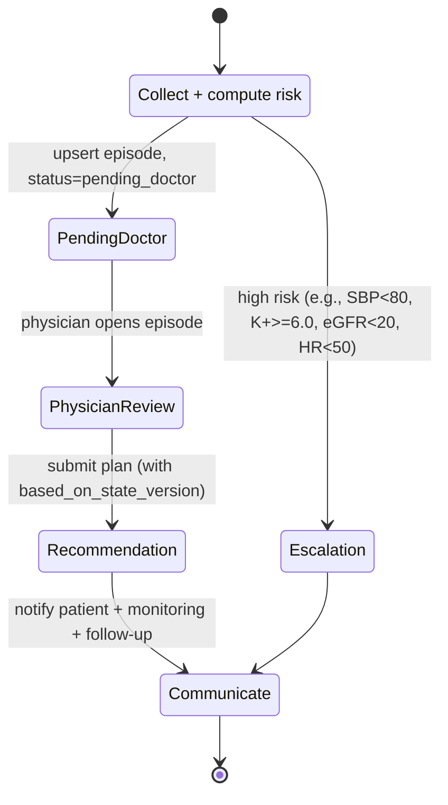
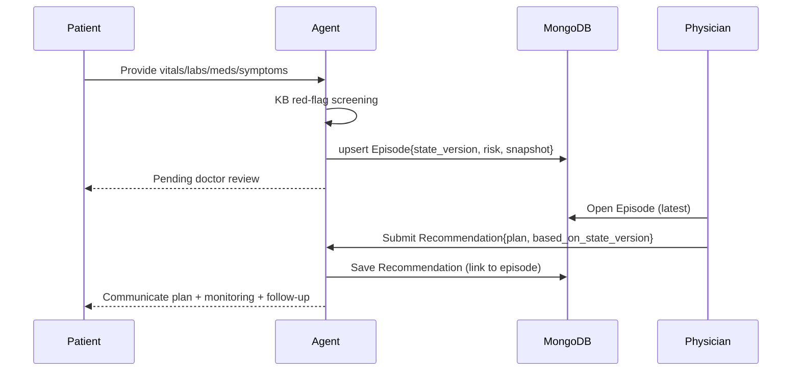
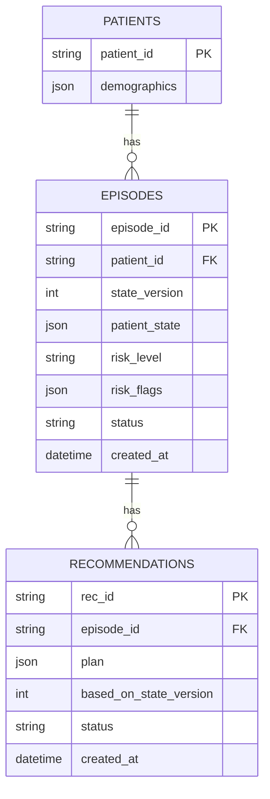
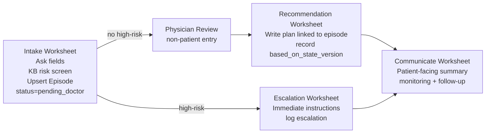

# HF-Agent Architecture (Worksheets + Async Physician Loop)

This document summarizes the end-to-end design we aligned on and provides visual diagrams you can include in slides or reports. Implementation note: we plan to use the OpenAI Agent SDK for runtime and MongoDB for persistence. The high-level workflow, safety gates, and versioning do not change.

## Conceptual Phases
- Phase 1: Patient → Agent Intake (async persisted)
  - Collect vitals/labs/meds/symptoms/adherence; compute red-flags (KB-driven) and persist an episode snapshot.
  - Status becomes `pending_doctor`. Conversation ends with a pending notice.
- Phase 2: Physician → Agent Review (async decision)
  - Physician reviews the episode snapshot and risk flags, chooses a strategy and submits a Recommendation (up-titrate/maintain/down-titrate/hold/stop, plus monitoring and follow-up).
  - Recommendation records `based_on_state_version` to avoid stale-plan execution.
- Phase 3: Agent → Patient Communicate (execute plan)
  - Agent communicates physician-approved plan to the patient, sets follow-up, and logs communication.
  - If high-risk at any time, emit an Escalation record and instructions.

## State Machine (high-level)

Notes
- If using OpenAI Agent SDK, treat these as agent steps/tools rather than worksheets: Intake (collect + risk), PhysicianReview (MD input surface), Recommendation (persist plan), Communicate (patient-facing summary), Escalation (safety instructions). The control flow and persistence are unchanged.

## Async Event Timeline

## Data Model (minimal)
Logical model below remains the same; in MongoDB this maps to collections.

Status enums
- Episode.status: `pending_doctor | approved | denied | communicated | closed | escalated`
- Recommendation.status: `draft | final | communicated | superseded`

## Worksheet Mapping

## MongoDB Collections & Indexing (implementation note)
- Collections
  - `patients`: `{ _id: patient_id, demographics, created_at }`
  - `episodes`: `{ _id: episode_id, patient_id, state_version, patient_state, risk_level, risk_flags, status, created_at, updated_at }`
  - `recommendations`: `{ _id: rec_id, episode_id, plan, based_on_state_version, status, created_at }`
  - `messages` (optional): `{ _id, episode_id, role, content, ts }` to store raw logs and structured turns
- Write pattern
  - Upsert `episodes` on Intake completion using a deterministic `episode_id` (or server-generated) and increment `state_version`.
  - Insert `recommendations` with `based_on_state_version`; reject/flag if `episodes.state_version` has advanced when applying.
  - Append conversation turns into `messages` for audit.
- Indexes
  - `episodes`: `{ patient_id: 1, created_at: -1 }`, `{ status: 1 }`
  - `recommendations`: `{ episode_id: 1, created_at: -1 }`
  - `messages`: `{ episode_id: 1, ts: -1 }`
- Idempotency & concurrency
  - Include an `idempotency_key` on writes where appropriate; on conflicts, return the previously written document.
  - Use `based_on_state_version` to prevent stale plans after a newer Intake.

## KB Red-Flags (from protocol)
- Hypotension: SBP < 80 (severe) or SBP < 90 with symptoms (dizziness/syncope)
- Hyperkalemia: K+ ≥ 6.0 (severe); > 5.5 (moderate → hold/adjust)
- Renal: eGFR < 20; Creatinine increase > 30% (hold/reassess)
- Bradycardia: HR < 50 bpm
- Others: as specified per class (ACEi/ARB/ARNI, MRA, beta-blocker, sGC, hydralazine/ISDN, SGLT2)

## Consistency & Idempotency
- Always persist `state_version` in episodes; every Recommendation must record `based_on_state_version`.
- If a new Intake produces `state_version+1`, flagged recommendations become stale → physician must update or reconfirm.
- Use idempotency keys on writes to avoid duplication.

## Auditability
- Save `decision_trace`: which KB rules/thresholds triggered and why.
- Record communication to the patient (message, channel, timestamp) for traceability.

## What to Build Next
- A minimal physician-entry UI (or worksheet) to submit Recommendation for a given episode.
- A small job that changes Episode.status from `pending_doctor` → `communicated` when plan is sent.
